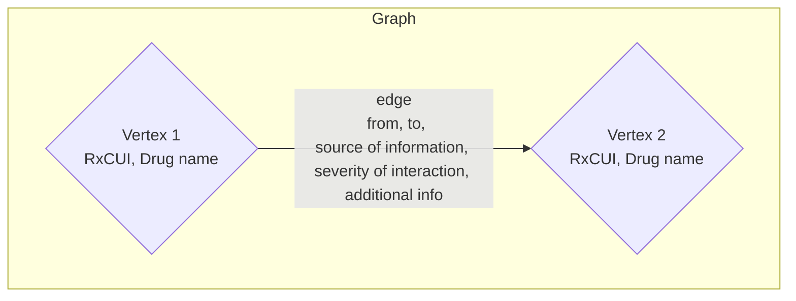

The file structure of the repository is listed below:

| File  | is directory?  | description |
|:-----:  |:-----:  |:-----:  |
| `templates` | ✅ | Django template html file (only contains `index.html`, which is responsible for rendering the app on Heroku)|
| `cache.json` | ❌ | Cached data from the **RxCUI** API. Only data cached during the development of the application is included |
| `forms.py` | ❌ | Django form python file, responsible for rendering and handling the form.  |
| `graph.py` | ❌ | Python file that contains the graph data structure and graph algorithms to handle the drug information and interaction data |
| `model.py` | ❌ | ?? |
| `views.py` | ❌ | Django view python file. I wrote all my application logic here. |

