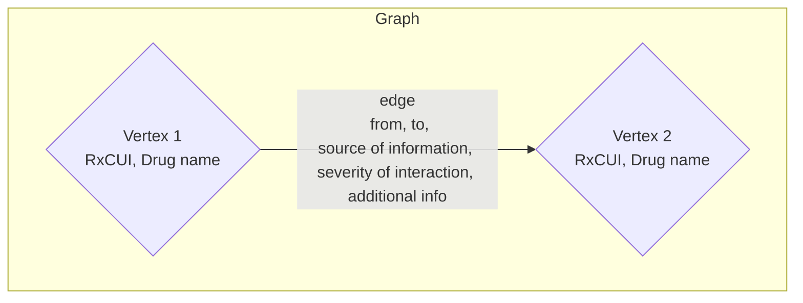

# my_app folder

## Directory Structure

The file structure of the repository is listed below:

| File  | is directory?  | description |
|:-----:  |:-----:  |:-----:  |
| `templates` | ✅ | Django template html file (only contains `index.html`, which is responsible for rendering the app on Heroku)|
| `graph.json` | ❌ | The json representation of graph data structure used in this project |
| `cache.json` | ❌ | Cached data from the **RxCUI** API. Only data cached during the development of the application is included |
| `forms.py` | ❌ | Django form python file, responsible for rendering and handling the form.  |
| `graph.py` | ❌ | Python file that contains the graph data structure and graph algorithms to handle the drug information and interaction data |
| `views.py` | ❌ | Django view python file. Contains all the application logic |
| `World_Countries_Generalized.zip` | ❌ | Shape files for the world map (for choropleth mapping) |

## Data Structure

The retrieved data is represented using a graph. On a high level, the graph is modeled using a graph class, an edge class, and a vertex class. The diagram above shows the relationship of graph, vertices, and edges.

A vertex holds the RxCUI code and corresponding drug name. An edge represents an interaction between drugs and holds information like the data source, severity, and additional information of the drug interaction aside from the “from” vertex and the “to” vertex. The graph has a vert_list and num_vertices attribute. The edge is modeled separately from the vertex class since the edge needs to hold the severity and description of the interaction. The complete graph definition and the BFS code for the graph can be found in the graph.py file.
